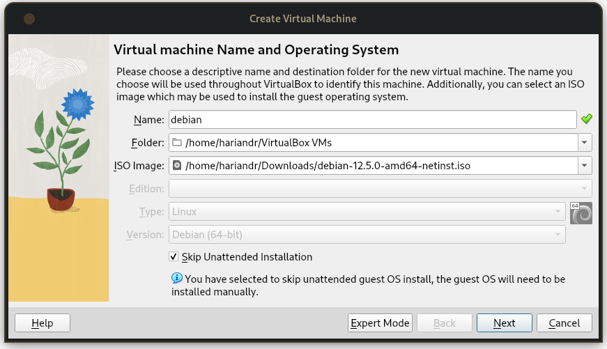
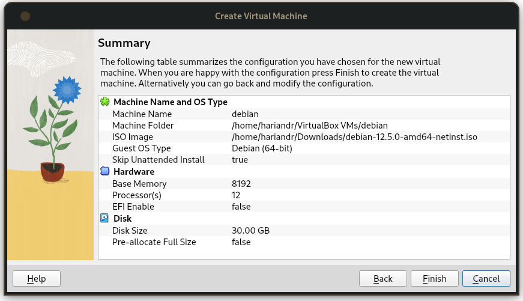
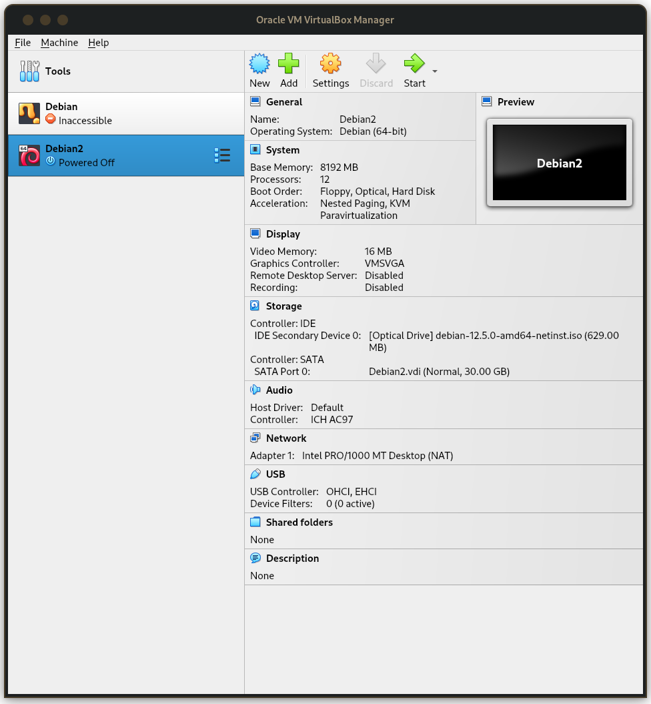
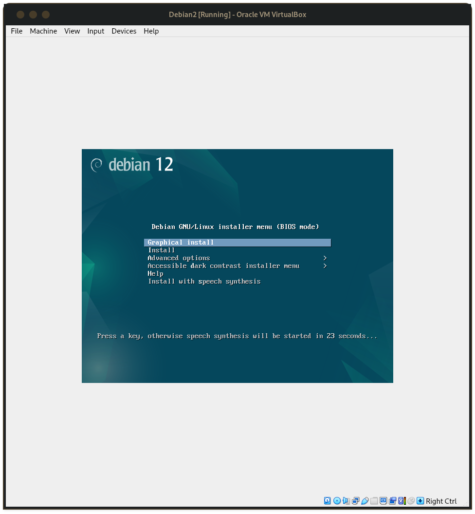
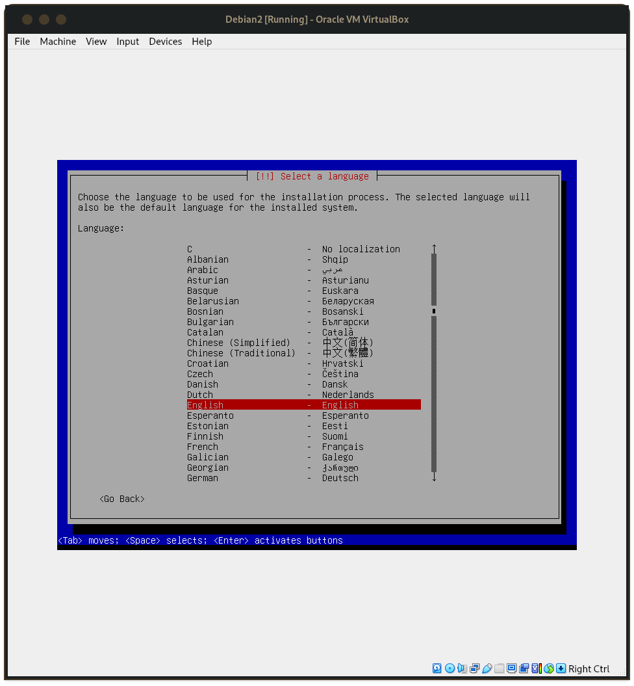
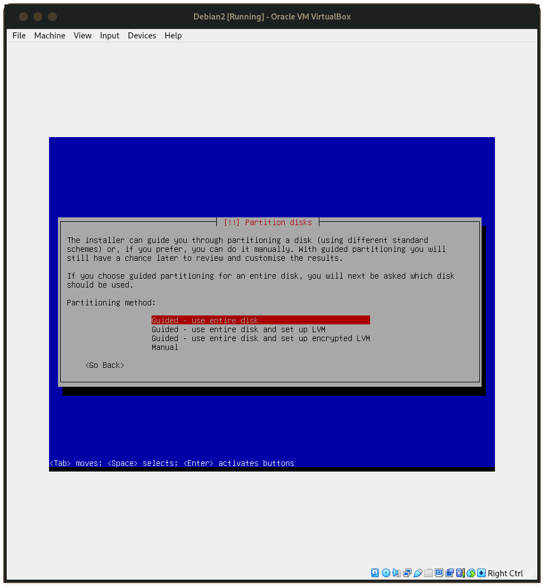
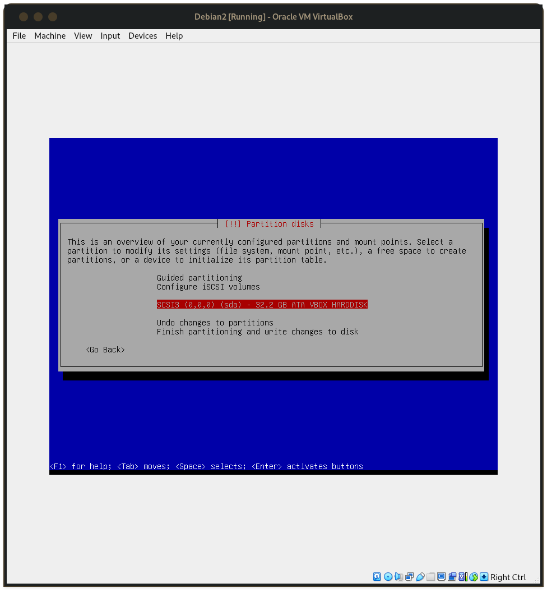
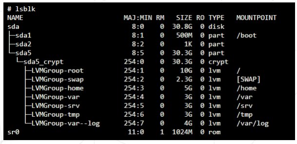

### Configuration de la machine virtuelle
- vous devez d'abord telecharger la version statble de [debian](https://cdimage.debian.org/debian-cd/current/amd64/iso-cd/debian-12.5.0-amd64-netinst.iso)
- Ensuite lancer le logiciel VirtualBox ou ce que vous utilisez
- vous allez appuyer sur `ctrl` + `n` pour ajouter une nouvelle machine virtuelle
- Choisir un nom (pour moi ce sera debian) puis faites comme l'image ci dessous

- apres cela vous allez choisir vos Hardware (le materiel utiliser) puis terminez la creation

### Installation du systeme avec partitionnement
- vous avez votre machine et ses details , pour commencer l'installation il suffit de cliquer sur demarrer

- apres demarrage, on vous demande de choisir entre plusieurs choix, mais nous installerons sans graphique c'est a dire `install`

- Ensuite, on vous demandera de configurer le clavier, region, etc (c'est a vous de les remlir)

- Puis on vous demandera de choisir un hostname, suivant le sujet il s'agira de votre **login** + **42** (skipper la partie nom de domaine)
- Puis on vous demandera un mots de passe pour le ***Root*** (je vous conseil de choisir un mots de pase similaire aux mots de passe de votre futur **User**)
- vous pouvez continuer jusqu'au partitionnement :stuck_out_tongue_winking_eye:
- maintenant on va faire le partitionnemt, nous allons le faire manuellement

- Selectionner le disque qui est dispo

- on a pour but : 

- pour avoir les bonne tailles il faut partitionner en Bytes donc :
	- `/boot` = **525336576** Bytes
	- `/` = **10737418240** Bytes
	- `[SWAP]` = **2469606195.2** Bytes
	- `/home` = **5368709120** Bytes
	- `/var` = **3221225472** Bytes
	- `/srv` = **3221225472** Bytes
	- `/tmp` = **3221225472** Bytes
	- `/var/log` = le reste
- vous devez avoir a peu pres ce resultats :

- Apres cela vous pouvez faire ce que vous voulez 
	- *PS :* il ne faut pas installer une interface graphique
	- *PS2 :* n'oubliez pas d'oinstaller GRUB manager ;)
